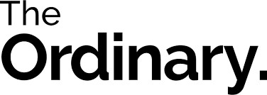

*Clean Beauty* has become a focal point of one's skincare. Whether that ranges from the Korean 10 step skin care routine to skincare savvies using *Paula's Choice Dictionary* to track ingredients, skincare has become an important part of the beauty industry. 

 Nowadays, the spotlight on single ingredients that are effective and knowledge of those products that we apply to our faces is absolutely crucial. Instead of the predominant focus on how to apply makeup to cover small imperfections today, we focus on natural products that are preventative whilst helping us target problematic areas making our skin perfect from within.

This is where *The Ordinary* comes in. On the need for clean and effective skincare, The Ordinary, as of 2016 successfully launched their skincare range at significantly low price points, whilst maintaining transparency about their products. A matter which the skincare industry had neglected to do for a number of years.

Unlike other brands, who made a fortune every year, out of the marketisation of their product focusing on phrases  such as 'glowy skin', 'clear skin', 'targeting acne prone skin', *The Ordinary* pioneered their path by creating affordable, high quality single ingrediant skincare products. 

*The Ordinary,* does not concentrate on its marketing and advertising approach, yet their minimalist approach of marketing the brand, still is highly alluring for skincare and ingredient list fanatics. But how have they been able to maintain such a strong profile without having a dominant online presence? How does their brand retain the original values even after the growth of the company?

The answers are in the colours that *The Ordinary* uses which are minimalis, indicative of the fact that the focus is based on the research and quality of the skincare rather than the creation of fancy, luxurious branding. The colours appear to be gender neutral as they range from black, white and grey yet the bold choices of colour show the scientific element of these products. The  company is intent on sharing its knowledge with their skin care consumers, rather than scaring its audience away with its scientific approach. *The Ordinary* consumers  are encouraged to make informed decisions about their individual skin care needs.  

The typeface, *The Ordinary,* use is Raleway. It is a sans-serif typeface which conveys simplicity and elegance. It is used for both the headings and body of text. Bold is used for headings whilst Semibold for subheadings. Raleway Regular is used for body copy and the use of Light for the captions.

The tone of voice *The Ordinary* has is:

Friendly, Informative, Scientific, Clear and Concise, Low-Profile

*The Ordinary*'s secret to success is knowing their demographic. Whether that is loyal individuals who know how to solve any issues when it comes to skincare due to their knowledge of the Ordindary  ingredients and formulas; or their second demographic who are new to this skincare world whose main concern is how reliable is the product. *The Ordinary*'s goal is to maintain a trusted, casual community, whilst providing insightful instruction without aggressively targetting new customers with endless social media campaigns or fancy packaging and typography.

Would you consider *The Ordinary* when creating a new skincare regimen?