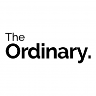

Over the years the trend to have clean beauty and makeup in one's routine has become a focal point to one's skincare regimen. The ranges vary from 10 step Korean skin care to dictionaries such as Paula's choice that focus on ingredients and how harmful they may be in skin care products. Instead of focusing on multiple promises a bottle of product promises us more than ever we have become sucked in to the idea of research and knowledge of what we apply on our faces.

This is where *The Ordinary* comes in. On the need for clean and effective skincare The Ordinary as of 2016 managed to launch their skincare products at significantly low price points yet continuing the efforts for transparency within the skincare industry which had been lacking in the scene. Unlike other brands, who make a fortune every year, out of the marketisation of a product focusing on words such as 'glowy skin', 'clear skin', 'targeting acne prone skin', *The Ordinary* pioneered in creating affordable and high quality skincare products which specifically focused on one ingredient products to aid targeted areas on one's skin. 

*The Ordinary,* does not focus on its marketing and advertising approach, yet their minimalist approach of marketing the brand, still is an eyecatcher for skincare and ingredient list fanatics. But how have they been able to maintain such a strong profile without changing their values since their growth?

The colours that *The Ordinary* uses are minimalist which is indicative of the fact that the focus is based on the research and quality of the skincare rather than the creation of fancy and luxurious branding. The colours appear to be gender neutral as they range from black, white and grey yet the bold choices of colour show the scientific and serious nature of these products, which by no means does the company want to scare its audience away but rather help the consumer benefit to the maximum through the skincare line.

The typeface, *The Ordinary,* use is Raleway. It is a sans-serif typeface which potrays a simplicity and elegance. It is used for both the headings and body. Bold is used for headings as well as semibold for subheadings. Raleway Regular is used for the body copy and use light for the caprtions.

The tone of voice *The Ordinary* has are:

* Friendly , Informative, Scientific, Clear and Concise, low- profile

  *The Ordinary*'s skincare know their audience whether that is individuals who know how to solve any issues when it comes to ingredients and formulas one needs however there is a second demographic who are new to the skincare world who's main concern is how reliable is this product which is also The Ordinary's goal to create a trusted environment and casual yet insightful instruction when it comes to the use of their skincare range. Would you choose *The Ordinary* when creating a new skincare regimen?