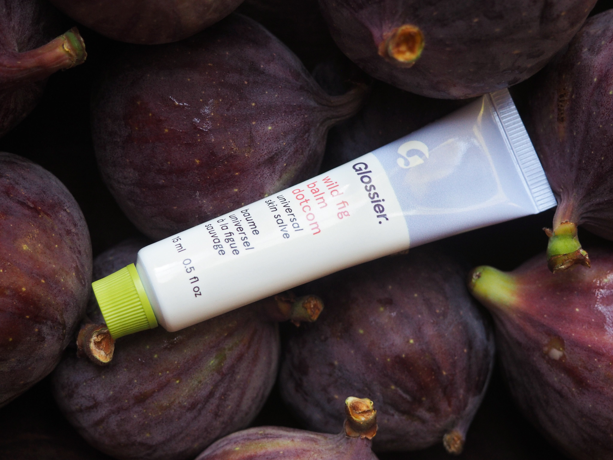
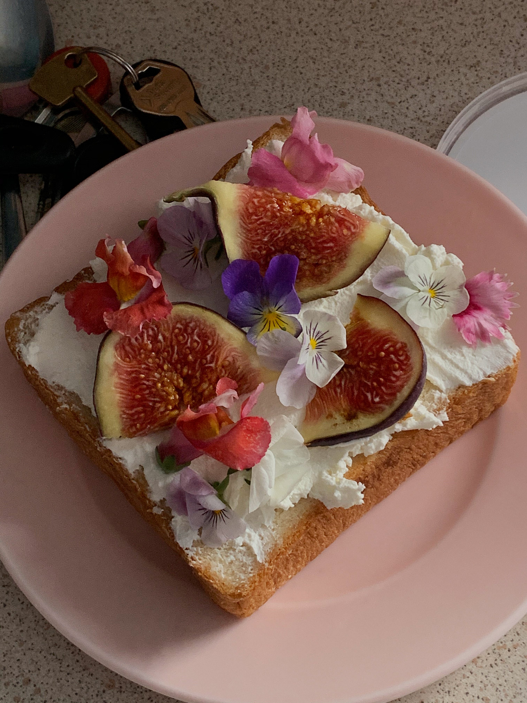
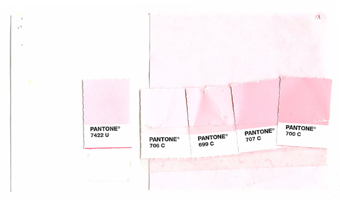
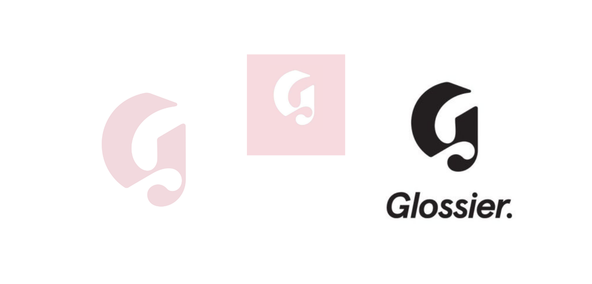
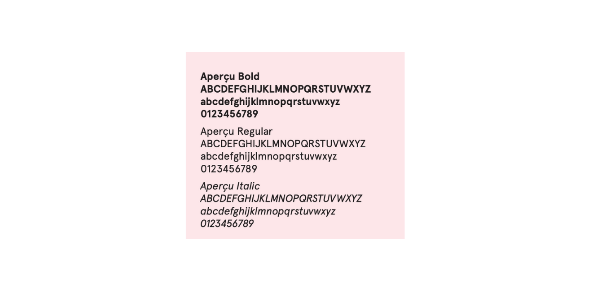

If one asked Millennial women to name one skincare brand that coems to mind that would be *Glossier.* Having built an empire with a strong online presence through their marketing website, their Instagram account as well as their presence on Youtube, *Glossier* has constructed the idea of luxurious yet simple and natural skincare and makeup that's aim is the democratisation of the skincare industry. What draws you to the brand however may be the presentation of a highly photogenic product especially in this day an age. Glossier is the revolutioniser for natural glowy skin that does not hide behind the constructions of makeup.

But what actually makes the brand?

The tone of voice of the brand show exactly what Glossier is about. Glossier gives great emphasis to these particular values which have shaped Glossier. These are:

Thoughtful, Inclusive, Fun, Innovative, Friendly

The colours of Glossier are set to:

Characteristic and iconic colours of pink across the colour palette allude to femininity and simplicity which is encouraged by the shades of pink due to the softeness and lightness of these colours. The colours of the brand are also white which helps bring together a clean minimalist and instagramable aesthetic. The wordmark sometimes changes depending on the use and background of its placement.

Glossier uses Apercu as its Primary font which has unity and minimlism in its typography. Apercu Bold is used for headlines, Apercu Regular for the body text and Apercu Italics is used for the product description on packaging and on the website. Lowercase is used on the packaging.

