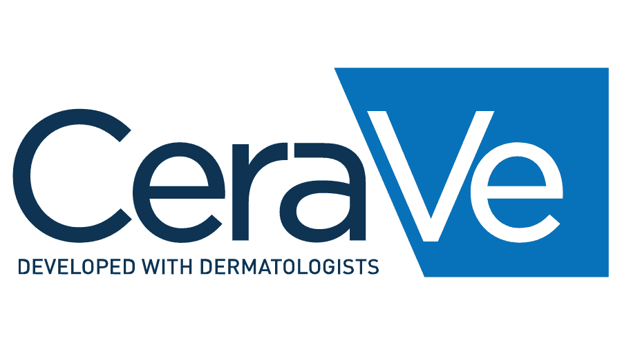
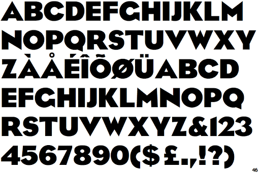

From drugstore purchases to online shopping CeraVe, with a little help from TikTok, became a product sensation across the skincare community. CeraVe created a Cult. 

Being number one in sold out skincare not only on a national but international level, it has become a must have for teens. But who are CeraVe and how have they gained such popularity?

The magic world of TikTok and skincare influencers such as [Skincare by Hyram](https://www.youtube.com/channel/UC2sYit3cZ2CuD_8FHYH7O_Q) definitely have a lot to do with the brands success and popularity in the last few months.The trending #skincarebyhyram and the #SkinCare videos on TikTok have received simultaneously over a billion views as people want to perfect their skin and their skincare routines. 

<iframe width="560" height="315" src="https://www.youtube.com/embed/xA-BxSKV0aU?rel=0" allow="accelerometer; autoplay; encrypted-media; gyroscope; picture-in-picture" allowfullscreen></iframe>

As 2020 has been the year of dedicating time to yourself and being competent at something new, CeraVe definitely became a skincare milestone for people who have been tired of trying skincare that typically does not work.

The importance of CeraVe lies in the fact that it was created by dermatologists rather than major pharmaceutical companies. It is a newly formulated brand that made its first launch in 2006 with its core products, with a range of approximately 70 products today.  

However, the branding didn’t always look the same even if they retained the same values.

The tone of voice of the brand show what CeraVe’s values emphasise on. These are:

Characteristic to the brand are its colours. Blue is the primary and dominant colour of the brand. White is a neutral colour that was first implemented in the whole text and after the rebranding of CeraVe the Ve remained white as opposed to the rest of the text. The Ve in white as well as the remaining capitalisation of the letter V make the brand unique yet signifies minimalism. The trademark and “developed with dermatologists” is  oftenly included in the branding, providing a sense of security and comfort. Consumers feel that they belong in the safe hands of dermatologists. 

However CeraVe has a whole colour palette depending on the skin issues one faces, however each individual colour portrays a particular value:

* Pantone 000C: cleanliness and simplicity
* Pantone 1225C: positivity and happiness
* Pantone 453C: security and protection
* Pantone 268C: uniqueness and success
* Pantone 534C, 280C, 2198C: trust and reliability 
* Pantone 337C and 360C : natural
* Pantone 228C: balance and harmony

The CeraVe brand is simplistic and features the company name in a minimal yet stylish way. The typography is sans-serif uppercase and the fonts resemble ITC Blair light and Trade Gothic Extended by Adobe.

CeraVe does not focus on the extensive marketisation of their products but the focus is on their formulas which is why their consumers remain loyal. Their success is cemented in this trust.