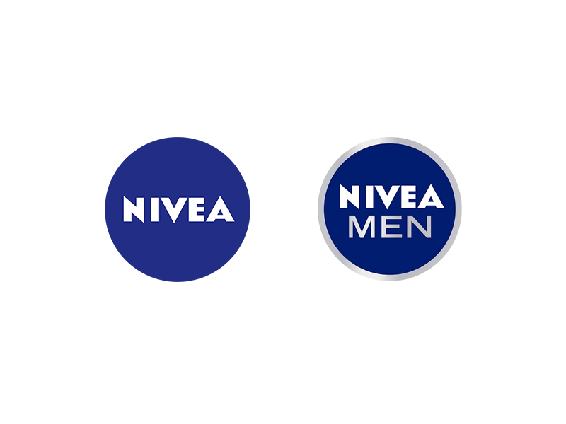
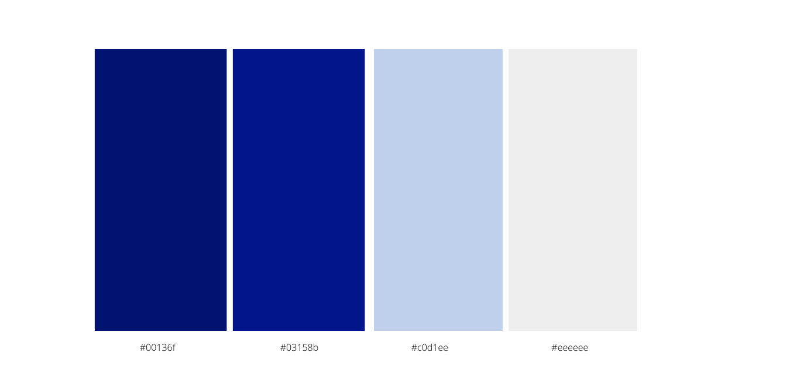

When it comes to men and skincare, there is a distinct lack of education and of acceptance of the need for men to use skincare products by society. This has resulted in the skincare community developing a distinctly restrictive product range which blindly follows the belief that one product will suit every skin type. 

The idea that men do not need or want products that will suit their skin is still highly prevalent today. Despite the battle to encourage men to adopt a skincare routine in their daily lives, this demographic has not been given the attention, care nor the support to solve everyday skin conditions and promote healthy complexions. The societal battle of what is deemed masculine and right for men is far from over.

What with the expansion of the media, there  has been a breakdown of barriers whereby a minority of men have delved into the skincare industry with more certainty and confidence, choosing to take care of themselves and their appearance. They are implementing a ritual that assists in boosting confidence and one's image  through a simple skincare ritual.

The Nivea Men skincare range is widely recognised for its uniqueness and popularity, but how has the brand been successful in keeping up with its image for its male consumers and are Nivea Men doing enough for this particular demographic?

Nivea Men was launched in the 1980’s when Nivea understood that there was a gap in the market. At that time, only a limited selection of  products for men were available as soap and water were perceived as all that male skin required. Hence the creation of the alcohol-free Aftershave Balm, a product that both won over men to buy it  and firmly established Nivea Men  in the male skincare marketplace.

Today Nivea Men, offers a large variety of products from creams, shampoos, styling products, shower and body care, facial and anti aging products. 

The tone of the brand illustrates exactly what Nivea Men stands for which is male empowerment through the use of skincare products. 

Energetic, bold, vibrant, physical, balanced and brave are the values that Nivea Men hold close in order to gain society’s acceptance of a male skincare line.

Nivea’s advertising and packaging approach towards men is very different from their approach towards women. Again, this is to ensure the promotion of the manliness of the range. Nivea promotes women wanting to look good and embrace their beauty however, men are promoted to  want to feel good and unleash their full potential.

The primary colours of Nivea Men, are set to:

It is no coincidence that the shades of blue are iconic when it comes to Nivea Men. The strong dark colour palette highlights boldness and masculinity. Grey and white are included in the colour palette with a subtle grey circle around the logo and the added word Men to demonstrate the difference between male and female products.

The typeface used as the main font for Nivea is Eagle Bold. Bold is used for the main body and heading of the logo on all products. “Men” is of sans serif typeface which conveys minimalism and simplicity whilst enforcing masculinity and strength.

Nivea Men aims to empower and embrace skincare for men, by putting men first.