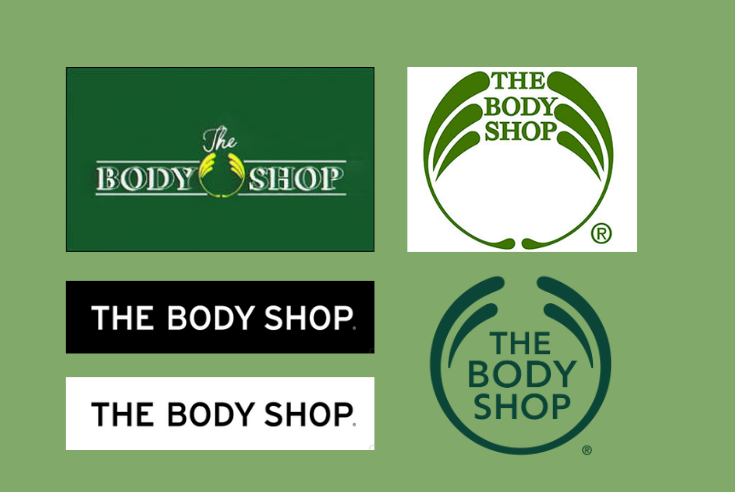
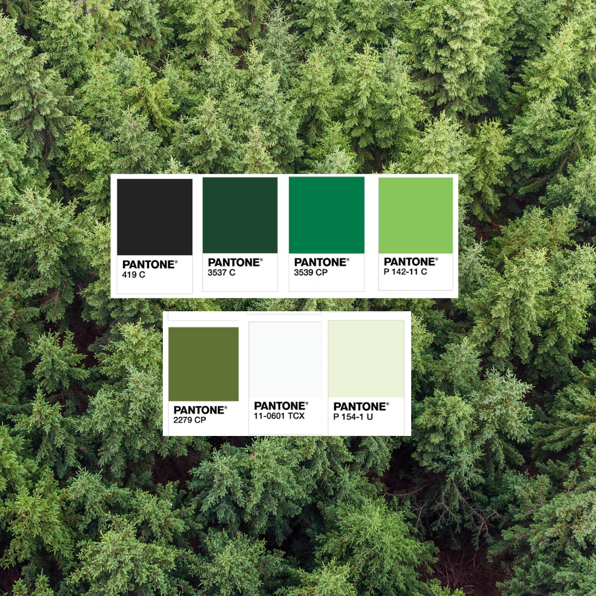
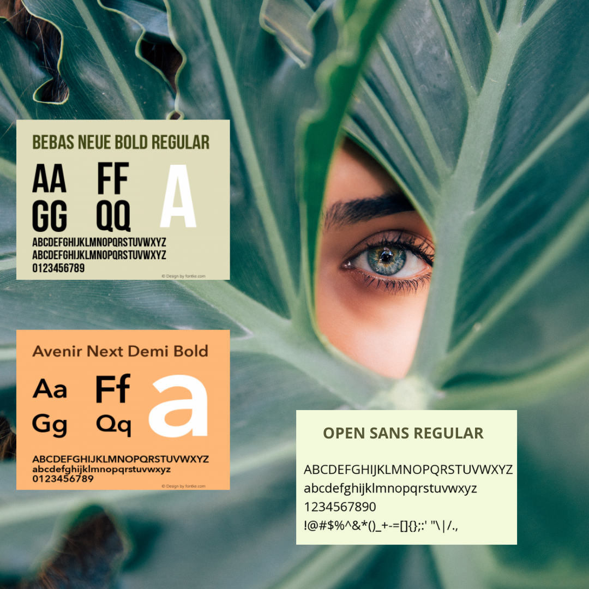

One of the most discerning values that acted as an impetus for change across the beauty and skincare industry was sustainability. 

The idea of sustainability is not a new concept, forty years ago this was one of the central principles from which the Body Shop evolved. Its foundations were firmly rooted in sustainability, strong ethics and ensuring the use of natural resources in all products. 

In a world where beauty standards revolved around the notion of looking glamorous and  measuring up to societal norms of what was considered beautiful,  the Bodyshop turned this on its head and promoted feeling confident and good within one’s own skin, thus pioneering products for everyone.  Essentially the Bodyshop’s vision was to:

* Produce products that work.
* Be ethical with regards to trading and sustainable. 
* Bring good quality products to their customers.

Unlike other brands within the industry, the Body Shop has prided itself on producing highly ethical and low cost products. These products are typically aimed at young women between 22-55 who are ambitious, adventurous, educated, confident and who hold the environment in high regard.

The brand logo has undergone major changes since its first appearance, but its values have remained the same despite having been bought by a large pharmaceutical company.

The Body Shop’s tone is playful, enthusiastic, casual and fun. The brand aims to create a strong relationship between itself and consumers therefore the language used in products is  simple, accessible and easy to understand. 

The brand uses a green colour palette which reinforces the values of ethically sourced products and respect of the environment. The use of black and white are also incorporated in the products and the logo to balance the shades of green used.

The typeface The Body Shop uses changes depending on its use. The headings of the brand incorporate Bebas Neue due to its eye catching boldness of the typography. Avenir Next is used in Semi Bold and Regular for subheadings and the main body, elevating the text from simple to modern. Open Sans is only used as a main body; it is simple yet accessible for all.

Forty years on and refreshingly the same values are still upheld and respected by a new generation.