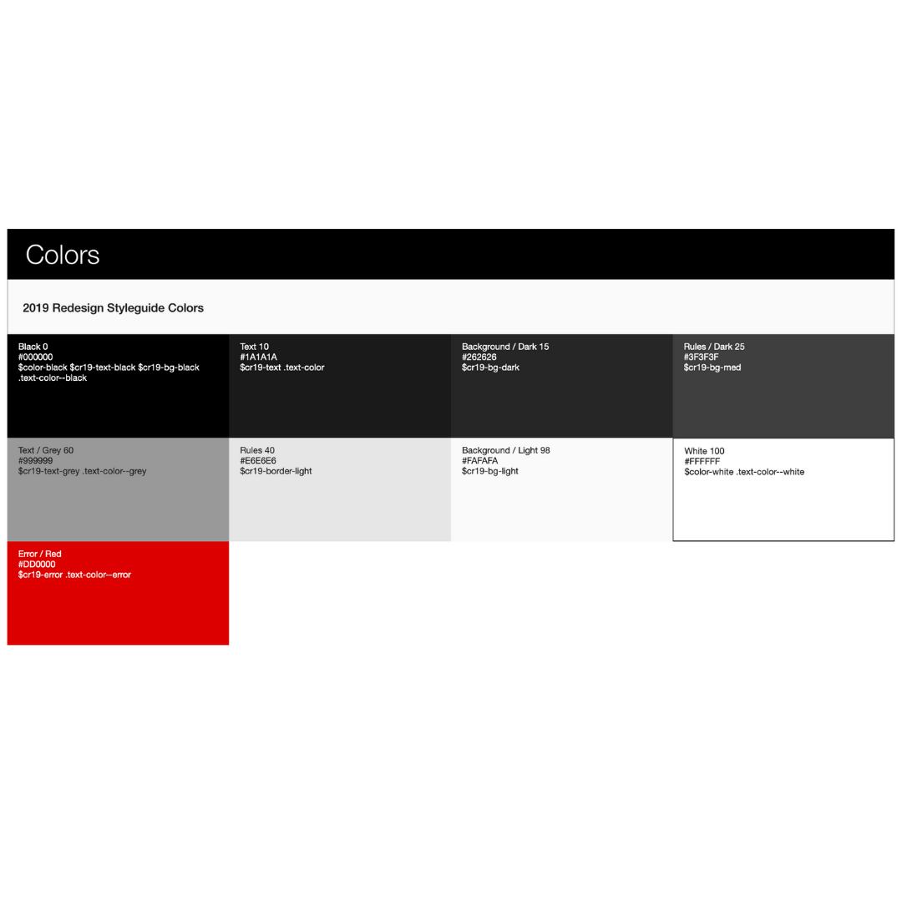

In the late 1960’s the idea of allergy tested and fragrance free products was born. Before Clinique, the notion of changing the skin type one’s born with and targeting problematic areas with specific skin care products tailored for the individual was unheard of. Only products for universal use existed before Clinique. 

Clinique is a luxury skincare brand that first appeared on the global market in 1968. The company is pioneered for being the first skin care brand of 100% fragrance free  and allergy tested products. Putting the customer first and offering them a unique personal experience, Clinique is recognised for their well-trained sales representatives whose wide range of skincare knowledge, product recommendations and customer service cement their loyal customer base.

Clinique distributes their products over make up counters in department stores as well as speciality beauty shops. Customer loyalty is founded on the individual customer experience the brand offers as opposed to extensive marketing techniques preferred by other skincare brands. Their products sold to physicians are not commercially advertised however, in the past Clinique has collaborated with botox manufacturer Allergan creating a pre-post in-office cosmetic procedures line. 

The brand’s ability to target a 16-55 audience range is due to the large variety of skin care products that tackle different skin types.

Clinique’s tone is relevant, modern and engaging, whilst maintaining the balance  between the needs of their customers with their products. 

The colour palette has remained minimalist and consistent with products set to yellow and green for cleansers and moisturizers. The typography is set to silver, light pink and white shades. Since the 2019 rebranding, the colour palette has included more greys, blacks and whites thus strengthening the idea of simplicity. The logo has remained constant throughout the years with their instantly recognisable colours and fonts.

Clinique uses Jorvik Informal typography for their logo. It is a wobbly serif that is simple yet effective with the use of contrasted sans serif. Helvetica Neue is used as the primary font of the brand with grotesque sans.

Clinique remains close to their original values and ideas whilst maintaining a strong relationship with their audience yet constantly improving and creating new lines to meet the ever developing needs of all skin types.