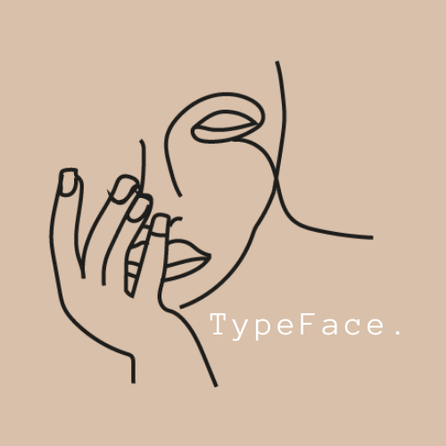
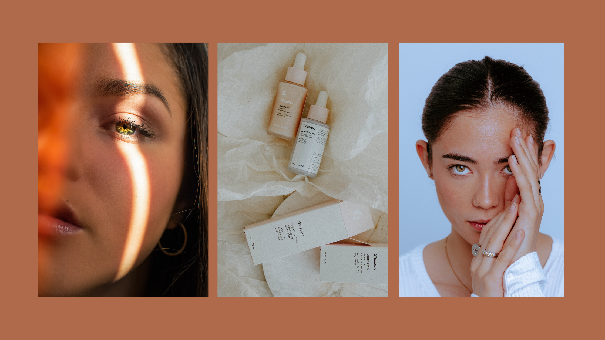
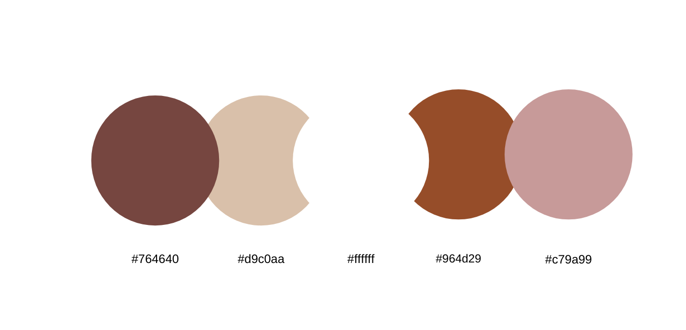
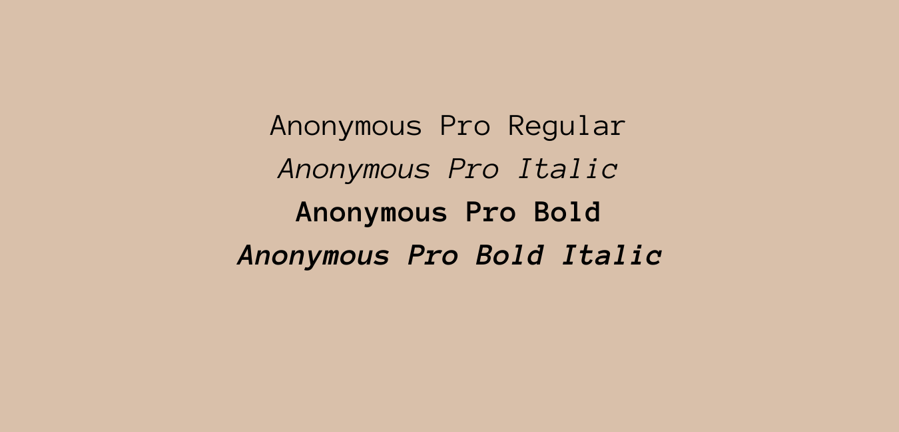
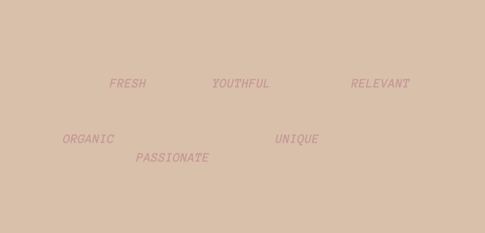

*TypeFace.* is a skincare site that looks at a plethora of different skincare brands on the market that have changed the way the beauty and skincare industry operate. It looks at the different, up and coming trends which have been brought about through the power of social media and therefore shaping modern day skincare and beauty regimes. *Typeface.* assists in creating and demonstrating a profile for these established and emerging beauty companies for skincare fanatics like myself. 

This website is a project idea for a university assignment which focuses on the development of the *TypeFace.* brand and the online presence through its development. By researching specific brands, examining their marketing techniques and the approach to their targeted audiences through the use of textual elements within their branding that stand out to its customers, I will be identifying the success of their values and messages which may even have caused the decline in the revenue of a skincare product.

Examples of packaging, online branding and posters in relation to skincare can be found here.

The colours of *TypeFace.* were chosen specifically to stand out and engage skincare fanatics. These colours allude to purity and cleanliness rather than focusing solely on femininity which tends to be the norm in the skincare industry.

Anonymous Pro is the typeface used for TypeFace, it is a monospaced font which allows all font to horizontally exist taking the same amount of space yet coexisting harmoniously. It contains normal, italic, bold and bold italic styles. Anonymous Pro's ability to change yet fit in perfectly with TypeFace.'s tone made it a great choice for its functionality.

The tone of *Typeface*. was mindfully crafted. These are some of the values central to *Typeface.* 

