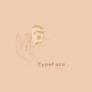
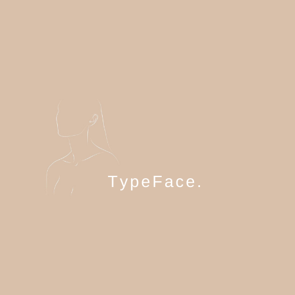

Hello, I'm Holly Humphries-Tsioumi. 

I'm a Media, Publishing and Journalism undergraduate at Oxford Brookes University. I'm a skincare fanatic which explains the launch of *Typeface*.

*TypeFace.* is a skincare site that looks at a plethora of diffrent skincare brands on the market that have changed the way the beauty and skincare industry operate. It looks at the diffrent up and coming trends which have been brought about through the power of social media that have shaped modern day skincare and beauty regimes. *Typeface.* assists in creating and demonstrating a profile for these old and emerging beauty companies for skincare fanatics like myself. 

This website is a project idea for a uni assignment which focuses on the development of a brand and the online presence through the development of this website. This website will focus on the research of specific brands examining their marketing techniques and the approach to their targeted audiences through the use of textual elements within their branding that stand out to its customers or even have caused decline in the revenue of a skincare product.

On this website you will find examples of packaging, online branding and posters in relation to skincare.

The colours of *TypeFace.* were chosen specifically to stand out and engage skincare fanatics. These colours aloud to purity, cleanliness not just focusing on femininity which tends to be the norm in the skincare industry.

Anonymous Pro is the typeface used for TypeFace, it is a monospaced font which allows all font to horizontally exist taking the same amount of space yet coexisting harmoniously. It contains normal, italic, bold and bold italic styles. Anonymous Pro's ability to change yet fit in perfectly with TypeFace.'s tone made it of great choice and use for the site.

The tone of Typeface. was of great importance in the making of the brand and the website. These are some things Typeface. is about:

